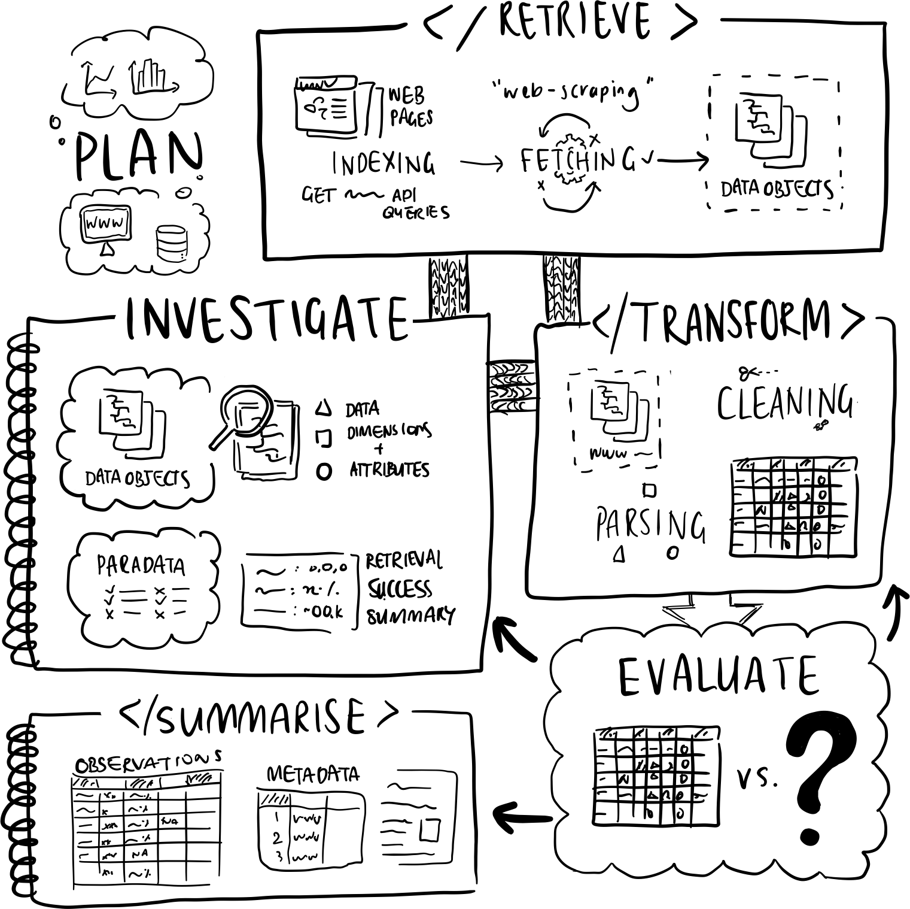
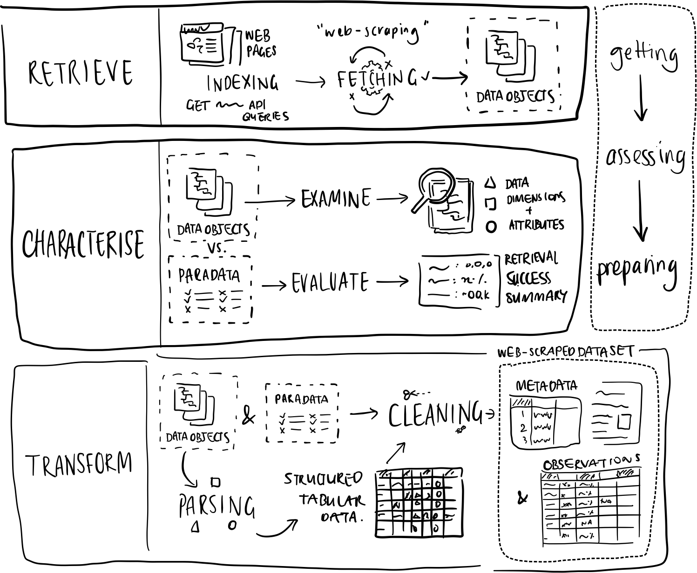

# Images for Crossmaps Project


## Submoduling Instructions

Run these commands from inside the target repo (i.e. the one you want
these images to be available in)

To add the contents of the latest commit of the default branch of this
repo as the folder `images/`:

``` zsh
git submodule add <repo-url.git> images
```

Updating contents to match the latest commit:

``` zsh
git submodule update --remote --merge
```

to match remote:

``` zsh
git submodule update --remote --rebase
```

## Useful ImageMagick Commands

Crop & transparent background:

``` zsh
magick filename.png -trim -transparent white filename.png
```

For details see:
<https://www.cynthiahqy.com/posts/imagemagick-basic-trim/>

## Setup pre-commit hook

To make sure this README renders every time you add a new commit, move
the file `pre-commit` to `.git/hooks/` and make the script executable:
`chmod +x .git/hooks/pre-commit`

To skip the render when you commit add the `--no-verify` flag:

    git commit --no-verify

## Images

Make sure to render README.qmd again after adding new images

## Graphics

graphics/diagram_alcohol-dataset-process.png


graphics/diagram_collaboration-opportunities_v02.png


graphics/diagram_matrix-academic.png


graphics/diagram_matrix-industry.png


graphics/diagram_project-overview.png


graphics/pptx-matrix


## Illustrations

illustrations/Diagram_PRITES-framework.png



illustrations/Diagram_PRITES-numbered.png


illustrations/diagram_PRITES-provenance-artefacts-tritone.png


illustrations/diagram_PRITS-framework.png


illustrations/diagram_RCT-framework.png



illustrations/PRITES-six-task-icons


illustrations/PRITES-twotone


## Plots

plots/display-anomaly.png


plots/display-gg-wine-top3-store-color-1.png


plots/display-marc-cat-facet-hist-log10-1.png


plots/display-product-state-matrix.png


## Screenshots

screenshots/harmonisation-3-tabs.png


